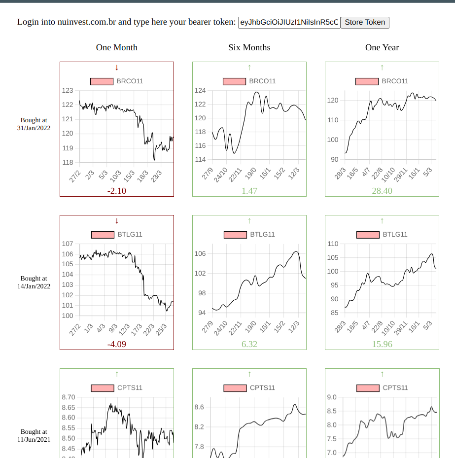

# CheckInvestments

This project was generated with [Angular CLI](https://github.com/angular/angular-cli) version 17.0.0.

## Development server

Run `ng serve` for a dev server. Navigate to `http://localhost:4200/`. The application will automatically reload if you change any of the source files.

## Code scaffolding

Run `ng generate component component-name` to generate a new component. You can also use `ng generate directive|pipe|service|class|guard|interface|enum|module`.

## Build

Run `ng build` to build the project. The build artifacts will be stored in the `dist/` directory.

## Usage

- Login into nuvinvest.com.br
- Inspect the page, go to the Network tab and get the Auth Bearer token from a request to  https://www.nuinvest.com.br/api/>>anything<<
- Paste the token inside the "token" field
- Click "Store Token". The token will be stored into the LocalStorage and the application will use it to perform requests

